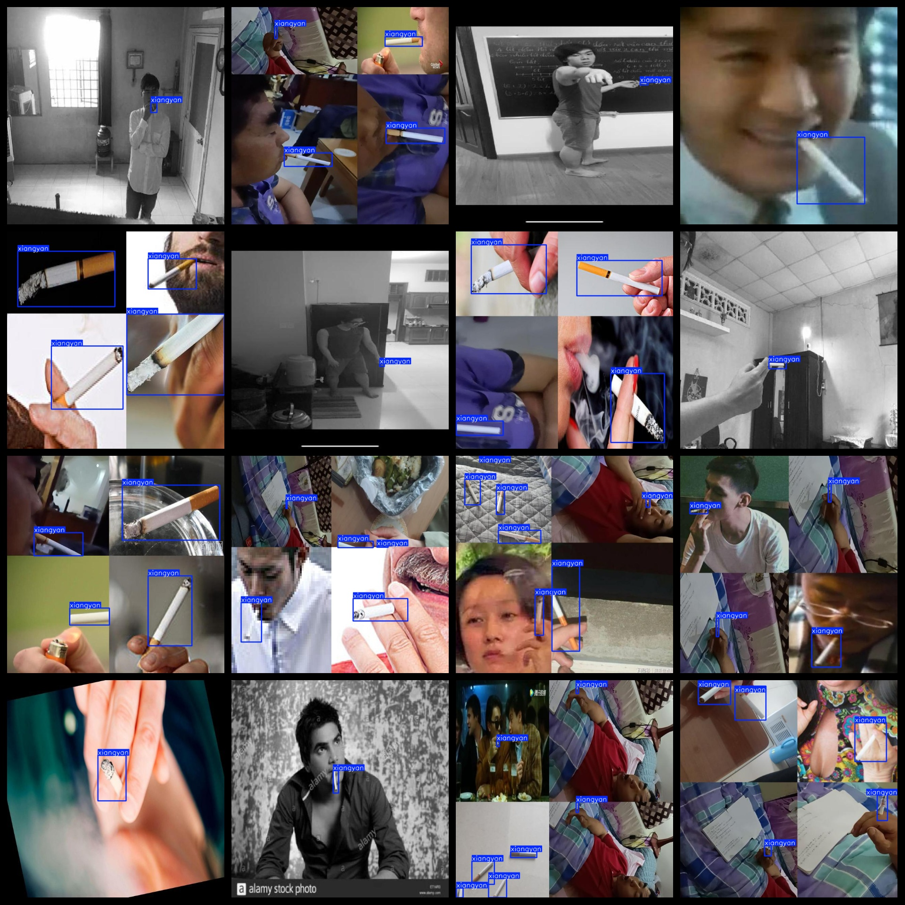

# [Object Detection] fragrant smoke Dataset 8519 imagesYOLO+VOC（(Augmented) ）

Dataset Format: VOC format + YOLO format

Dataset Introduction: The vast majority of the images are smoking images, with a small portion being cigarette images. Smoking images are labeled.

The compressed file contains: three folders, each storing images, xml files, and text files.

Total jpg images in JPEGImages folder: 8519

The total number of XML files in the Annotations folder is 8519.

The total number of .txt files in the labels folder is 8519.

Number of tag types: 1

Tag names: ["xiangyan"]

The number of boxes for each label (Note that the order of labels in the Yolo format does not correspond to this, but is based on the classes.txt file in the labels folder):

xiangyan frame count = 21260

Total boxes: 21260

Picture clarity (Resolution: Pixels): Clear

Images augmented: Yes

Shape of the label: Rectangular box, used for object detection and recognition.

Important Note: None

Special Notice: This dataset does not guarantee the accuracy or precision of the trained models or weight files. The dataset only provides accurate and reasonable annotations.

No specific annotation provided.

Picture overview

## Images

---

Here is a pay link on Stripe (https://buy.stripe.com/3cs8yP7sY87d0vu9AB). Please contact me lonlonago@foxmail.com after funding $89, and I will send you a complete data files, thank you!

